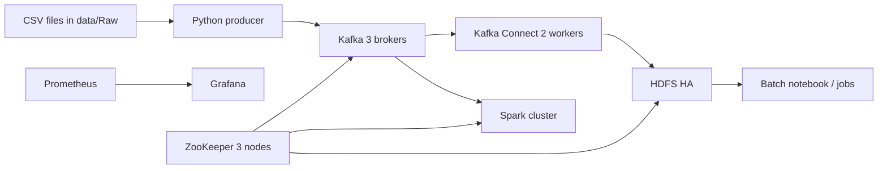

# RAN Intelligence Platform

Distributed RAN telemetry demo built around Docker Swarm, ZooKeeper, Kafka, HDFS, Kafka Connect, Spark, Prometheus, and Grafana.

## Current Status

This repository contains a partially integrated platform and its deployment scripts. It is **not currently a verified end-to-end deployment**.

As of 2026-08-21:

- The checked-in `docker-stack.yml` is not deployable as-is because it ends with a stray `y` after the `volumes` section.
- The stack defines three ZooKeeper nodes, three Kafka brokers, two Kafka Connect workers, HDFS HA components, two Spark masters, three Spark workers, one ClickHouse service, Grafana, and Prometheus.
- `scripts/bootstrap-cluster.sh` refers to one-time services that are not defined in the stack (`hdfs-format-nn1`, `hdfs-bootstrap-nn2`, and `hdfs-smoke-test`).
- `scripts/run-4g-demo.sh` and `scripts/validate-4g-demo.sh` query consumer group `connect-${CONNECTOR}`, while Kafka Connect is configured with group ID `ran-connect-cluster`.
- No successful cluster deployment, 4G demo, validation run, or failover test is recorded in this repository.
- The Spark streaming file is present but empty. The batch notebook is Colab/Google Drive-oriented, and the ML script expects a dataset and columns that are not present in `data/Raw`.
- Airflow, replicated ClickHouse tables, integrated Grafana dashboards, and an integrated ML output path are not currently present in the repository.

Treat the commands below as intended workflows and diagnostics, not as evidence that the complete platform is operational.

## What Is Included

### Infrastructure

- Docker Swarm stack: `docker-stack.yml`
- Three-node ZooKeeper ensemble
- Three Kafka brokers using ZooKeeper mode
- Two Kafka Connect workers using the local image `ran-kafka-connect-hdfs3:3.0.12`
- HDFS HA configuration with two NameNodes, three JournalNodes, three DataNodes, and two ZKFC services
- Two Spark masters and three Spark workers
- One ClickHouse service
- Prometheus and Grafana services

### Data and processing

- Ten CSV files in `data/Raw` covering GSM, LTE, and NR telemetry
- CSV-to-Kafka producer in `Kafka/producer/producer.py`
- Producer image definition in `Kafka/producer/Dockerfile`
- Kafka Connect configurations in `configs/connect/` and `Connect/`
- 4G Kafka-to-HDFS demo scripts in `scripts/`
- Batch notebook in `Spark/batch/RAN_Batch.ipynb`
- ML prototype in `Spark/ml/anomaly_detection.py`

## Repository Layout

```text
.
├── docker-stack.yml                 # Docker Swarm stack definition
├── configs/                         # Kafka, HDFS, Spark, monitoring, and Connect config
├── Connect/                         # Kafka Connect image and connector definition
├── Kafka/producer/                  # CSV producer and image build files
├── Spark/
│   ├── batch/RAN_Batch.ipynb        # Exploratory batch notebook
│   ├── ml/anomaly_detection.py      # ML prototype
│   └── streaming/                   # Streaming image and job location
├── data/Raw/                        # Source CSV datasets
└── scripts/                         # Deployment, demo, validation, and cleanup scripts
```

## Architecture Actually Defined by the Stack



The stack has three Kafka brokers, not five. It has one ClickHouse service, not a replicated ClickHouse deployment. The current Prometheus configuration scrapes Prometheus itself; dashboard definitions are not checked in.

## Prerequisites

- Linux host(s) with Docker installed and a Docker Swarm initialized
- A Swarm with nodes labeled `node_id` values `1`, `2`, and `3`; inspect `scripts/label-nodes.sh` before running it
- Repository files available on the node from which the stack is deployed, and any nodes that need bind-mounted or locally built assets
- Local images:
  - `ran-kafka-connect-hdfs3:3.0.12`
  - `ran-producer:1.0` for the 4G demo
- Sufficient CPU, memory, and disk for Kafka, HDFS, Spark, and their persistent Docker volumes

The stack uses fixed service hostnames such as `kafka1`, `kafka2`, `kafka3`, `namenode1`, and `namenode2`. Review placement constraints and host-specific assumptions before using it on a new cluster.

## Deployment Workflow

The following is the intended order. The current stack and bootstrap script require repair before this can complete successfully.

```bash
# Initialize or inspect the Swarm
bash scripts/init-swarm.sh
docker node ls

# Label nodes as required by the stack
bash scripts/label-nodes.sh <node-1> <node-2> <node-3>

# Deploy the stack
bash scripts/deploy.sh
docker stack services ran-platform
docker stack ps ran-platform

# Intended cluster initialization
bash scripts/bootstrap-cluster.sh ran-platform

# Deploy the Kafka Connect connector
bash scripts/deploy-connector.sh
```

Before deployment, fix the YAML syntax error and reconcile `scripts/bootstrap-cluster.sh` with the services actually defined in `docker-stack.yml`. Do not assume that a `docker stack deploy` command succeeding means that HDFS or Kafka initialization succeeded.

## 4G Demo

The demo uses `Dataset_01_LTE_2100.csv` by default, publishes to `ran-4g-demo`, and waits for Kafka Connect to write JSON records to HDFS under:

```text
/ran-4g-demo-data/ran-4g-demo
```

Run it from a host where the script can see the `kafka2`, `connect2`, and `namenode2` service containers:

```bash
bash scripts/run-4g-demo.sh
bash scripts/validate-4g-demo.sh
```

Useful overrides include:

```bash
DEMO_TOPIC=ran-4g-demo \
DEMO_CONNECTOR=ran-4g-hdfs-sink \
SOURCE_FILE=Dataset_01_LTE_2100.csv \
bash scripts/run-4g-demo.sh
```

The topic must be empty before a new run. The producer image must already exist locally, and the Connect image must be available to the Swarm nodes. The current lag check is likely incorrect because the scripts use `connect-${CONNECTOR}` instead of the configured Connect group `ran-connect-cluster`.

To remove demo data and its local producer container, inspect the cleanup script first because it is destructive:

```bash
bash scripts/cleanup-4g-demo.sh
```

## Configuration Notes

There are two distinct connector/demo configurations:

| Configuration | Topic | Purpose |
|---|---|---|
| `configs/connect/ran-4g-hdfs-sink.json` | `ran-4g-demo` | 4G demo sink to HDFS |
| `Connect/connector-hdfs3.json` | `ran-telemetry` | General telemetry connector definition |

The producer defaults to `ran-telemetry`, while the 4G demo overrides the topic to `ran-4g-demo`.

## Verification and Diagnostics

Useful read-only checks are:

```bash
docker node ls
docker stack services ran-platform
docker stack ps ran-platform --no-trunc
bash scripts/validate-4g-demo.sh
```

For a failed service, inspect its task history and logs:

```bash
docker service ps --no-trunc ran-platform_<service>
docker service logs ran-platform_<service>
```

The validation script checks Swarm replicas, Kafka brokers and records, connector status, HDFS HA state, DataNodes, HDFS record counts, and HDFS health. A failed validation is expected while the known stack and script issues remain unresolved.

## Known Gaps

- `docker-stack.yml` has a trailing invalid character and must first pass YAML/Compose validation.
- `scripts/bootstrap-cluster.sh` expects missing one-shot services.
- The demo and validation scripts use a consumer-group name inconsistent with the stack's Kafka Connect configuration.
- The deployment scripts do not build or distribute the producer and Kafka Connect images.
- `scripts/init-swarm.sh` contains a hard-coded advertise address; review it before use.
- The Spark streaming implementation is empty and is not wired into the stack as a running job.
- The batch notebook uses external Google Colab/Drive paths rather than repository-relative input paths.
- The ML prototype expects `data/ran_telemetry.csv` and fields such as `signal_strength` and `latency_ms`, which are not supplied by the current raw datasets.
- ClickHouse is defined as a single service and is not wired to the Kafka or Spark data path.
- Prometheus and Grafana are present, but the repository does not provide the claimed operational dashboards or exporter configuration.
- Failover behavior is designed in configuration but has not been verified here.

## Project Direction

The repository is a foundation for a RAN telemetry platform and a 4G Kafka-to-HDFS demonstration. The next practical work is to make the stack valid, align bootstrap and validation scripts with the deployed services and Connect group, then verify the deployment from a clean Swarm before documenting HA, Spark, ClickHouse, ML, or dashboard behavior as complete.